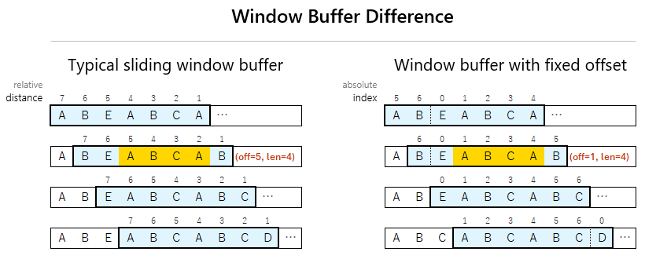

# Konami SNES Compression

This document describes a lossless compression format used in several Konami SNES games.
It combines LZ-style backreferences with several RLE commands and a small sliding window.

## Tools

The following tools can be used to compress and decompress data in this format:

* [Konami SNES Compressor (konami_c)](https://github.com/ProtonNoir/SNES-decompression-tools)
* [Konami SNES Decompressor (konami_d)](https://github.com/ProtonNoir/SNES-decompression-tools)

## Data Structure

Compressed data begins with a 2-byte header.

| Size    | Description                                 |
|---------|---------------------------------------------|
| 2 bytes | Compressed size (includes the field itself) |
| n bytes | Compressed stream                           |

The decompression loop processes commands until all bytes specified by the size header are consumed.

## Compression Format

The compressed data consists of a sequence of commands, each beginning with a control byte:

```
76543210
CCCLLLLL
```

Where the fields are defined as follows:
- `C`: Command bits
- `L`: Length

The following command types are used during decompression:

| Range     | Command                 | Extra Bytes | Description                                |
|-----------|-------------------------|-------------|--------------------------------------------|
| 0x00-0x7F | 0xx - LZ Copy           | 1           | Copy data from sliding window (see below)  |
| 0x80-0x9F | 100 - Raw Copy          | L           | Copy L raw bytes                           |
| 0xA0-0xBF | 101 - RLE Pair          | 1           | Repeat the sequence `[00 V]` (L + 2) times |
| 0xC0-0xDF | 110 - RLE Byte          | 1           | Repeat byte V (L + 2) times                |
| 0xE0-0xFE | 111 - Zero RLE          | 0           | Repeat zero byte (L + 2) times             |
| 0xFF      | 111 - Extended Zero RLE | 1           | Repeat zero byte (N + 2) times             |

`V` and `N` denote the value of the following extra byte.

During decompression, all output bytes are written to a buffer, which also serves as the sliding window for LZ references.

**Variation**: In earlier games that use this format, Extended Zero RLE (0xFF) is not supported.
It is treated as standard Zero RLE instead.

### LZ Compression (0x00-0x7F)

LZ compression works by reusing previously decompressed data, specified by an offset and length.

The decompressor uses a fixed **1024-byte sliding window**.

Unlike typical LZ implementations, the offset in this format is an index into the window, not a backward distance.
The following diagram illustrates this difference (the window size is reduced for clarity).



#### LZ Command Format

The command consists of the command byte and the next byte, which together encode a length and an offset, as follows:

```
76543210 76543210
0LLLLLoo oooooooo
```

Where the fields are defined as follows:
- `L`: Length (actual length = value + 2, range 2-33)
- `o`: Offset (0-0x3FF, adjusted as described below)

The length and offset can be computed as follows:

```
u8 command_byte, next_byte;
u16 command_word = (command_byte << 8) | next_byte;

u8 length = (command_byte >> 2) + 2;
u16 offset = (command_word - 0x3DF) & 0x3FF;
```

The constant 0x3DF corresponds to the 10-bit two's complement representation of -0x21, where 0x21 matches the maximum copy length (33).
